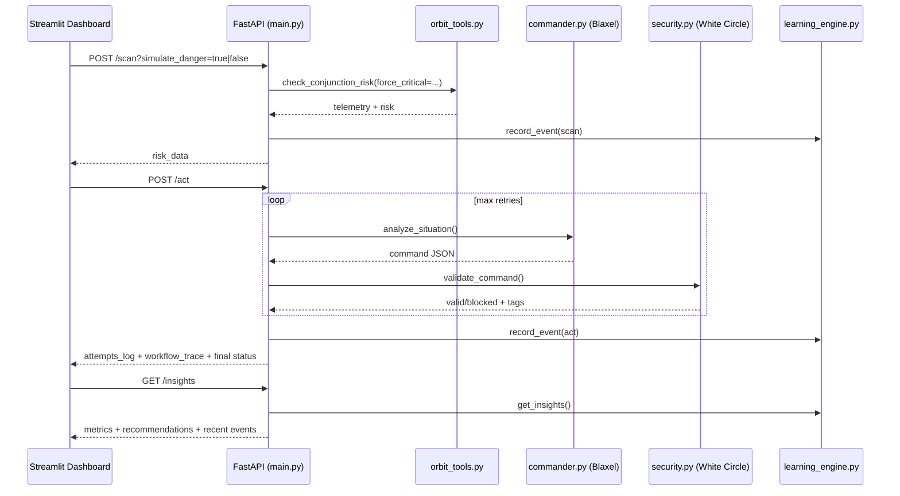

# Vyuha AI - Autonomous Orbital Defense System

Production-oriented autonomous space safety system that combines:
- live ISS telemetry ingestion (CelesTrak),
- AI mission decisions (Blaxel-hosted model),
- security guardrails (White Circle + local deny-list),
- transparent mission operations dashboard (Streamlit),
- runtime learning and failure analytics (`/insights`).

---

## Homepage / Quick Start

### 1) Local demo run

```bash
# Backend
source .venv/bin/activate
python -m agent.src.main

# Dashboard (separate terminal)
source .venv/bin/activate
streamlit run dashboard/app.py --server.port 8501
```

- Backend homepage: `http://localhost:8000/`
- API docs: `http://localhost:8000/docs`
- Dashboard: `http://localhost:8501`

### 2) Cloud deployment (Blaxel)

```bash
bl login rs
bl deploy
```

Current deployed public URL:
- `https://agt-vyuha-ai-w18o89.bl.run`

---

## System Design Architecture

```mermaid
flowchart TD
    A[CelesTrak Live TLE Feed] --> B[Orbit Engine MCP Tool]
    B --> C[FastAPI /scan]
    C --> D[Commander via Blaxel Model Gateway]
    D --> E[FastAPI /act Loop]
    E --> F[White Circle Validation]
    F -->|Safe| G[Execute Maneuver]
    F -->|Blocked| H[Feedback to Commander]
    H --> D
    E --> I[Learning Engine JSONL Store]
    I --> J[/insights Analytics Endpoint]
    C --> I
    J --> K[Streamlit Command Center]
    C --> K
    E --> K
```

### End-to-end request flow



---

## What is transparent in real time

- **Operational**: telemetry, status, collision probability, data source.
- **Agentic reasoning**: action + one-sentence rationale + confidence.
- **Guardrail decisions**: pass/fail source and violation tags.
- **Performance**: scan latency, act latency, request-level timings.
- **Learning**: persistent events, hotspots, recommendations, recent events.

---

## Real Results So Far (Observed)

### Live telemetry (non-forced)

Observed sample:

```json
{
  "status": "SAFE",
  "collision_probability": 0.1112,
  "distance_to_debris_km": 43.788,
  "data_source": "CelesTrak (Live) (...)",
  "scenario_mode": "LIVE_OBSERVATION"
}
```

### Simulated critical scenario (forced danger)

Observed sample:

```json
{
  "status": "CRITICAL",
  "collision_probability": 0.95,
  "distance_to_debris_km": 0.5,
  "scenario_mode": "SYNTHETIC_DEBRIS_INJECTION",
  "data_source": "CelesTrak (Live) (...)"
}
```

### Agent execution outcome

Observed sample:

```json
{
  "status": "EXECUTED",
  "final_command": {
    "action": "FIRE_THRUSTERS",
    "recommended_thrust_direction": "PROGRADE",
    "confidence_score": 0.95
  },
  "attempts": 1
}
```

### Insights output sample

Observed sample:

```json
{
  "execution_success_rate": 100.0,
  "latency_ms": { "scan_avg": 484.99, "act_avg": 3653.13 },
  "security_sources": { "fallback": 1 },
  "recommendations": [
    "Investigate White Circle availability...",
    "Reduce agent loop latency..."
  ]
}
```

---

## Problems Faced and Fixes

- **Blaxel deployment crash**: `Argument expected for the -m option`
  - Fix: explicit entrypoint in `blaxel.toml`:
    - `[entrypoint] prod = "python -m agent.src.main"`
- **Browser showed backend not working**
  - Root cause: `GET /` returned 404.
  - Fix: added root endpoint in FastAPI returning service status + endpoint list.
- **Port conflicts on local demo (`:8000`)**
  - Fix: terminate stale processes and restart cleanly.
- **Guardrail API instability**
  - White Circle occasionally falls back to local deny-list path.
  - Captured in `/insights` with recommendations.

---

## Security and Safe Operations

- `.env` is git-ignored; never commit real keys.
- API keys loaded via `python-dotenv`.
- White Circle + local deny-list blocks unsafe commands.
- Production-safe defaults:
  - bounded retries (`MAX_RETRIES`),
  - fallback safety posture (`HOLD_POSITION` on AI errors),
  - structured runtime logging.

---

## Repo Documentation Index

- `agent/README.md` - backend subsystem overview
- `agent/src/README.md` - module-by-module engineering details
- `agent/data/README.md` - runtime learning data model
- `dashboard/README.md` - mission control UI behavior and demo guidance

