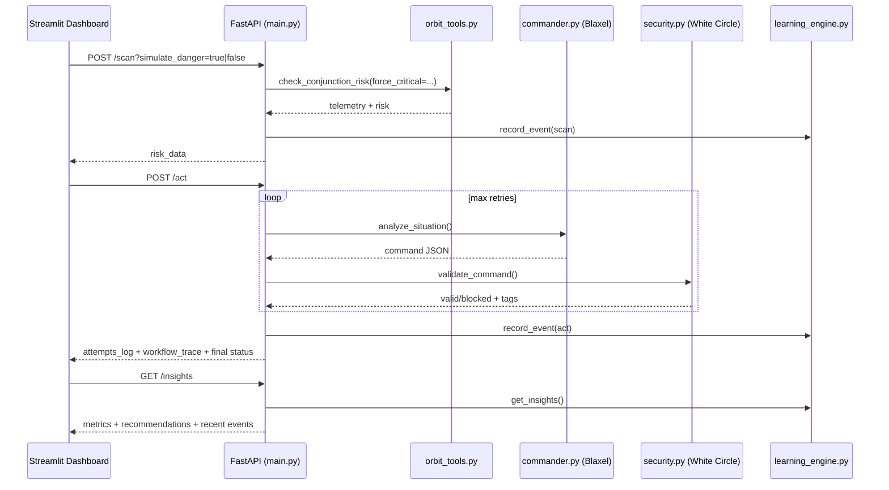

# Vyuha AI - Autonomous Orbital Defense System

Vyuha AI is a production-oriented autonomous space safety platform that monitors orbital risk, recommends maneuvers, validates safety policy, and learns from failures over time.

It is built for transparent operations: every step from telemetry ingestion to AI action validation is observable in real time.

---

## Why This Exists

Satellites face conjunction risk, but mission teams often lack a fast, explainable, and secure autonomous loop that can:
- ingest real orbital data,
- reason over risk quickly,
- enforce security policy before execution,
- and continuously improve from runtime behavior.

Vyuha AI solves this by combining Blaxel model infrastructure, White Circle security guardrails, and a transparent control dashboard.

---

## Core Capabilities

- **Live orbital ingestion**
  - Pulls real-time ISS TLE data from CelesTrak.
- **Hybrid demo mode**
  - Runs real telemetry while allowing forced critical scenarios for deterministic demonstrations.
- **Autonomous decision loop**
  - Commander model decides `FIRE_THRUSTERS` vs `HOLD_POSITION` using strict JSON output.
- **Security validation**
  - White Circle validation + local deny-list fallback for resilient safety checks.
- **Self-correction loop**
  - If a command is blocked, rejection feedback is fed back to the model for safer retry.
- **Learning and observability**
  - Persistent event logs + `/insights` analytics (latency, failures, hotspot tags, recommendations).
- **Mission command center UI**
  - Streamlit + Plotly interface with chain-of-thought visualization and learning panel.

---

## System Architecture

```mermaid
flowchart TD
    A[CelesTrak Live TLE Feed] --> B[Orbit Engine MCP Tool]
    B --> C[FastAPI /scan]
    C --> D[Commander via Blaxel Model Gateway]
    D --> E[FastAPI /act Loop]
    E --> F[White Circle Validation]
    F -->|Safe| G[Execute Maneuver]
    F -->|Blocked| H[Feedback to Commander]
    H --> D
    E --> I[Learning Engine JSONL Store]
    I --> J[/insights Analytics Endpoint]
    C --> I
    J --> K[Streamlit Command Center]
    C --> K
    E --> K
```

### Request Flow (Data to Action)



---

## Tech Stack

- **Backend API**: FastAPI, Pydantic, Uvicorn
- **Orbital mechanics**: Skyfield, NumPy, CelesTrak feed
- **AI decisions**: Blaxel + OpenAI-compatible client path
- **Security guardrails**: White Circle AI + local deny-list fallback
- **Frontend**: Streamlit + Plotly
- **Learning/telemetry**: JSONL event store + analytics endpoint (`/insights`)
- **Deployment**: Blaxel (`blaxel.toml`)

---

## Quick Start

### Local

```bash
# Backend
source .venv/bin/activate
python -m agent.src.main

# Dashboard (new terminal)
source .venv/bin/activate
streamlit run dashboard/app.py --server.port 8501
```

- Backend homepage: `http://localhost:8000/`
- OpenAPI docs: `http://localhost:8000/docs`
- Dashboard: `http://localhost:8501`

### Blaxel Deploy

```bash
bl login rs
bl deploy
```

Deployed public endpoint:
- `https://agt-vyuha-ai-w18o89.bl.run`

---

## API Endpoints

- `GET /` - service status + endpoint index
- `GET /health` - health and telemetry readiness
- `POST /scan` - live or simulated conjunction scan
- `POST /act` - autonomous commander + shield loop
- `GET /insights` - runtime analytics and recommendations
- `GET /docs` - OpenAPI UI

---

## Verified Outputs (Real + Simulated)

### 1) Real telemetry mode

```json
{
  "status": "SAFE",
  "collision_probability": 0.1112,
  "distance_to_debris_km": 43.788,
  "scenario_mode": "LIVE_OBSERVATION",
  "data_source": "CelesTrak (Live) (...)"
}
```

### 2) Simulated critical mode

```json
{
  "status": "CRITICAL",
  "collision_probability": 0.95,
  "distance_to_debris_km": 0.5,
  "scenario_mode": "SYNTHETIC_DEBRIS_INJECTION",
  "data_source": "CelesTrak (Live) (...)"
}
```

### 3) Autonomous act result

```json
{
  "status": "EXECUTED",
  "final_command": {
    "action": "FIRE_THRUSTERS",
    "recommended_thrust_direction": "PROGRADE",
    "confidence_score": 0.95
  },
  "attempts": 1
}
```

### 4) Insights (learning analytics)

```json
{
  "execution_success_rate": 100.0,
  "latency_ms": { "scan_avg": 484.99, "act_avg": 3653.13 },
  "security_sources": { "fallback": 1 },
  "recommendations": [
    "Investigate White Circle availability...",
    "Reduce agent loop latency..."
  ]
}
```

---

## Problems Faced and How They Were Solved

- **Blaxel startup failure**: `Argument expected for the -m option`
  - Added explicit entrypoint in `blaxel.toml`:
  - `[entrypoint] prod = "python -m agent.src.main"`
- **Backend looked down in browser**
  - Browser hit `/` while API only exposed `/health` initially.
  - Added root endpoint (`GET /`) for operator-friendly status page.
- **Port collisions in local demo**
  - Stale Uvicorn processes on `:8000`.
  - Added clean restart/kill procedure.
- **External guardrail instability**
  - White Circle occasionally unavailable.
  - Fallback path recorded in `/insights` with remediation recommendations.

---

## Production Readiness Notes

- Secrets are environment-based (`.env` is git-ignored).
- Runtime-generated logs (`agent/data/*.jsonl`) are excluded from git.
- Bounded retries and safety fallback responses prevent unsafe escalation.
- Structured logging + telemetry support post-mortem and performance tuning.
- Blaxel deployment manifest includes runtime tuning, triggers, and entrypoint.

---

## Future Roadmap

- Multi-satellite live ingestion beyond ISS (catalog-level monitoring).
- Probability model calibration using historical conjunction datasets.
- Automated policy tuning from recurring violation patterns.
- Canary release workflow for prompt/model updates.
- Alerting integrations (Slack/PagerDuty/email) for critical conjunction events.
- Signed command ledger for audit-grade compliance.

---

## Documentation Index

- `agent/README.md` - backend subsystem overview
- `agent/src/README.md` - module-level engineering details
- `agent/data/README.md` - runtime learning data model
- `dashboard/README.md` - command center UX and demo operation

